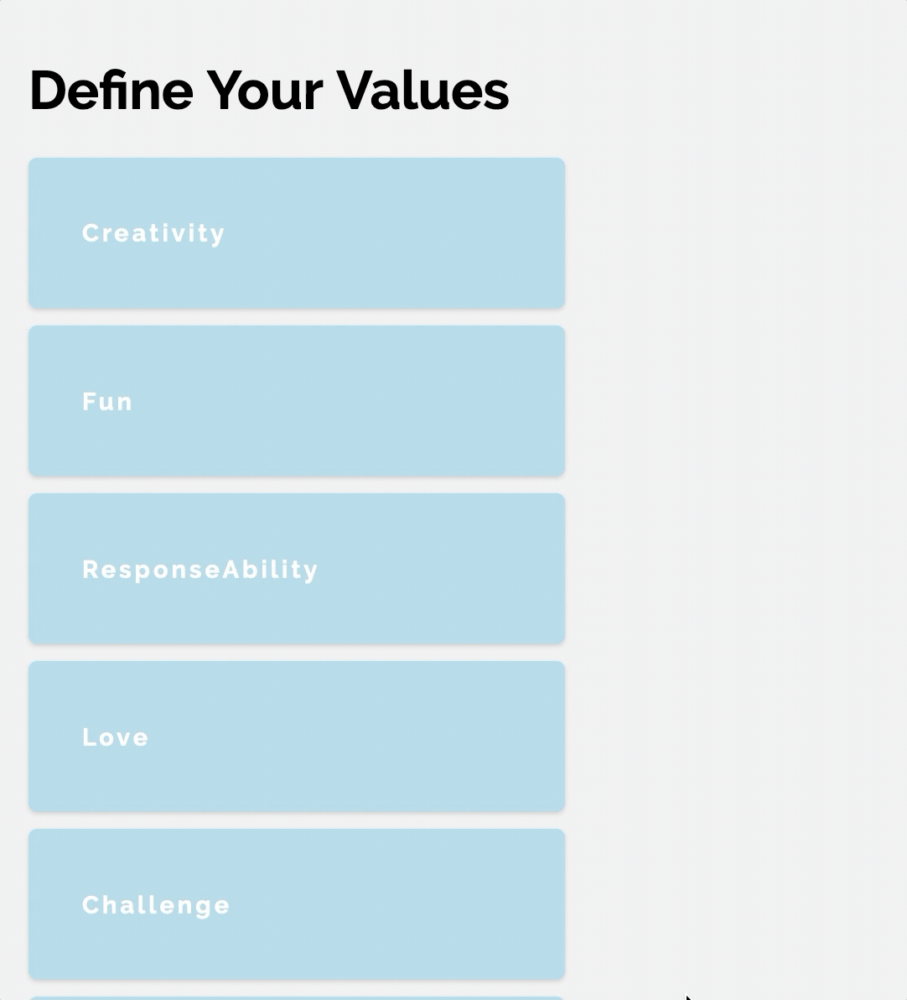

# define-your-values

In Tony Robbin's book, 'Unlimited Power', he explains that <strong>humans will perform at a peak level if their actions are congruent with their values.</strong> When actions and values are out of alignment a person will not be totally happy, or fulfilled.

This project serves as a way to find out the hierarchy of your values.

Check out the code sandbox to <a href="https://codesandbox.io/s/github/Senofjohan/define-your-values/tree/master/" target="_blank">Define Your Values</a>. In the file 'index.js' at the bottom you can replace the 'values={'...' with your own, separating each value with a comma. Once you have them added, reorder them to understand your hierarchy of values. It is useful to go one at a time, and see if something is more important than another value, then drag it up. For example, if 'love' is more important than 'creativity' you would move 'love' above 'creativity'. Then compare 'love' with the value above that. After doing one value in its entirety, move on to the next.

You can also play with adding or removing values, and thinking about how your life would change. Once you know what you value you can more easily make decisions in your day, and prioritize the things most important to you.

After you know your values, you can work on reorienting yourself so that your actions are more congruent and fulfilling.

### Values from Unlimited Power:
* Love
* Ecstasy
* Mutual communication
* Respect
* Fun
* Growth
* Support
* Challenge
* Creativity
* Beauty
* Attraction
* Spiritual unity
* Freedom
* Honest

Keep in mind what you consider 'fun' may be 'challenge' to someone else, and 'growth' to a third person.

Have an inspiring day!

This repo is a fork from codesandbox-https://codesandbox.io/s/draggable-list-vp020
